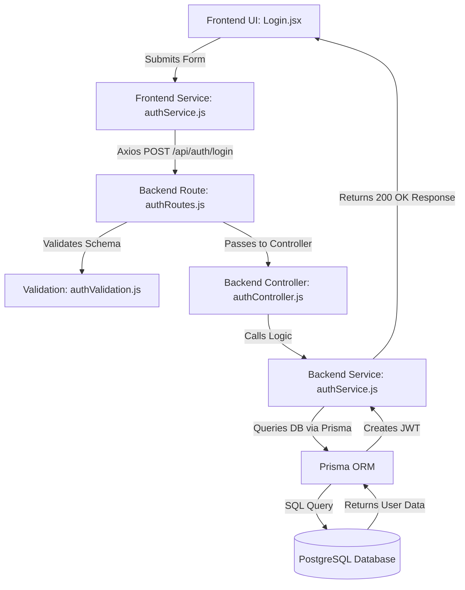

# CAHCET Project Structure Guide & Source Code Audit

This guide serves as a comprehensive developer-level documentation for the CAHCET platform. It covers the entire folder tree, file responsibilities, data flow, and provides a maintenance guide for common tasks.

---

## 1. Frontend Folder Audit (`frontend/src/`)

The frontend is a React Single Page Application built with Vite.

### **Core Folders**

*   **`admin/`**: Contains everything related to the Admin Portal. It's essentially an application within an application.
    *   **Purpose**: Isolate admin-specific logic, UI, and state from the public site.
    *   **`admin/components/`**: Admin specific UI (Modals, Editors, sidebars).
    *   **`admin/pages/`**: Admin views (`AdminDashboard.jsx`, `CMSManagement.jsx`, etc.).
    *   **`admin/services/`**: API wrappers for admin endpoints.
*   **`components/`**: Reusable UI components for the public-facing site.
    *   **`components/auth/`**: Protected route wrappers (`ProtectedRoute.jsx`, `Unauthorized.jsx`).
    *   **`components/departments/`**: Department-specific shared UI components (Sidebar, Layout).
    *   **`components/layout/`**: Global layouts like `Navbar.jsx` and `Footer.jsx`.
    *   **`components/sections/`**: Modular page sections (`HeroSection.jsx`, `PlacementsSection.jsx`). These control what users see on the main pages.
    *   **`components/ui/`**: Generic, low-level UI elements (Buttons, Loaders, Input fields).
*   **`context/`**: React Context providers for global state.
    *   **`AuthContext.jsx`**: Manages global authentication state for regular users. *Modifying this impacts login states system-wide.*
    *   **`ChatbotContext.jsx`**: State for the AI counselor widget.
*   **`data/`**: Static JSON-like Javascript files holding hardcoded data (fallback or initial state data).
    *   **`departments/`**: Specific data files for each branch (CSE, ECE, Mech, etc.).
    *   **`navigation.js`**: Controls the navbar links. *Modify this to add a new menu item.*
*   **`hooks/`**: Custom React Hooks.
    *   **`useAuth.js`**: Hook to consume `AuthContext`.
    *   **`useDepartmentData.js`**: Fetches and merges department data.
*   **`pages/`**: The top-level route views.
    *   **`Home.jsx`**: The main landing page.
    *   **`about/`**, **`academics/`**, **`admissions/`**, **`departments/`**: Specific feature pages mapping to URLs.
*   **`services/`**: API interaction layer using Axios.
    *   Every file (e.g., `authService.js`, `cmsService.js`) maps to a backend controller. *If a backend route changes, update the corresponding service file here.*
*   **`styles/`**: Global CSS styling.
    *   **`globals.css`**: Contains Tailwind imports and global CSS overrides.
*   **`utils/`**: Helper functions.
    *   **`cn.js`**: Tailwind CSS class merger (`clsx` + `tailwind-merge`).

### **File Example: `frontend/src/components/layout/Navbar.jsx`**
*   **Purpose**: The main top navigation bar.
*   **Responsibility**: Renders links, handles mobile menu toggle, shows user profile if logged in.
*   **Usage**: Imported and rendered inside the main routing layout.
*   **If modified**: Changes will reflect across every page of the public site. If broken, users cannot navigate the site.
*   **Depends on**: `frontend/src/data/navigation.js` (for links), `AuthContext` (for login state).

---

## 2. Backend Folder Audit (`backend/src/`)

The backend is a Node.js REST API using Express.

### **Core Folders**

*   **`config/`**: Configuration loaders.
    *   **`app.js`**: Main Express app configuration, middleware setup (CORS, Helmet, Body parsing).
    *   **`database.js`**: Database connection handlers.
*   **`constants/`**:
    *   **`permissions.js`**: Defines RBAC permission constants.
*   **`controllers/`**: The "C" in MVC. Handles request/response logic.
    *   **`authController.js`**: Handles login/register API logic. Connects to `authService.js`.
    *   **`cmsController.js`**: Handles saving/publishing CMS sections.
*   **`middleware/`**: Functions that run between receiving a request and hitting the controller.
    *   **`authMiddleware.js`**: Verifies JWT tokens. *If modified incorrectly, all protected routes become vulnerable or inaccessible.*
    *   **`permissionMiddleware.js`**: Checks if the logged-in user has the right RBAC role.
    *   **`errorMiddleware.js`**: Global error handler.
*   **`routes/`**: Defines the API URL endpoints and maps them to controllers.
    *   **`authRoutes.js`**: Defines `/api/auth/login`, `/api/auth/register`.
*   **`services/`**: Business logic layer (often interacts with Prisma).
    *   **`authService.js`**: Handles password hashing, token generation.
*   **`utils/`**: Helper functions.
    *   **`asyncHandler.js`**: Wraps async routes to catch errors without `try/catch` blocks.
    *   **`jwt.js`**: Logic to sign and decode JWTs.
*   **`validations/`**: Zod schemas for request validation.
    *   **`authValidation.js`**: Ensures login requests have email/password formats.

### **Entry Points**
*   **`server.js`**: The main entry file. Starts the HTTP server and binds to the specified port.
*   **`app.js`**: Initializes Express and attaches routes/middleware. (Separated from `server.js` for easier testing).

---

## 3. Admin Portal Audit

The Admin Portal relies heavily on specific frontend and backend files:

*   **Dashboard**: `frontend/src/admin/pages/AdminDashboard.jsx`. Shows metrics and stats.
*   **Homepage CMS**: Managed by `frontend/src/admin/pages/CMSManagement.jsx` talking to `backend/src/controllers/cmsController.js`.
*   **User Management**: Handled via `frontend/src/admin/context/AdminAuthContext.jsx` and RBAC logic in `backend/src/middleware/permissionMiddleware.js`.
*   **Admissions**: Admin view is at `frontend/src/admin/pages/AdmissionLeadsPage.jsx`.

---

## 4. Database Files

*   **`backend/prisma/schema.prisma`**
    *   **Purpose**: The single source of truth for the database schema.
    *   **Models**: Defines tables like `User`, `Department`, `ContentPage`, `ContentSection`, `Applicant`, `Application`.
    *   **What happens if modified**: You MUST run `npx prisma migrate dev` or `npx prisma db push` to sync the physical database. If modified without migrating, the backend will crash on database queries.
    *   **Related files**: `backend/prisma/migrations/` (auto-generated migration history files).

---

## 5. Environment Variables (`.env`)

Found in both `frontend/` and `backend/`.

**Backend (`backend/.env`)**
*   `PORT`: Port for the Express server (e.g., 5000). *If missing, defaults to whatever is hardcoded or fails.*
*   `DATABASE_URL`: Connection string for PostgreSQL. *If missing, Prisma throws connection errors, app crashes.*
*   `JWT_SECRET`: Secret key for signing tokens. *If missing, login/auth fails globally.*
*   `CLIENT_URL`: URL of the frontend (for CORS). *If missing, frontend API calls get blocked by CORS.*

**Frontend (`frontend/.env`)**
*   `VITE_API_BASE_URL`: Points to the backend (e.g., `http://localhost:5000/api`). *If missing, all frontend API calls fail (404/Network Error).*

---

## 6. Dependency Mapping (Data Flow Diagram)

How a request travels from a user clicking "Login" to the database:

---

## 7. Maintenance Guide

If you need to manually edit a feature, go to these specific files:

### **Change the Hero Section (Homepage Top Video/Image)**
1.  **Frontend File**: `frontend/src/components/sections/HeroVideoSection.jsx` or `HeroSection.jsx`.
2.  **Assets**: `frontend/src/assets/videos/hero-campus-video.mp4`.
3.  **Data**: Update `frontend/src/data/collegeData.js` if title/subtitle text is hardcoded there.

### **Change Admissions Form Fields**
1.  **Frontend Form**: `frontend/src/pages/admissions/dashboard/PersonalDetailsPage.jsx` and `AcademicInfoPage.jsx`.
2.  **Backend Validation**: `backend/src/validations/` (If a schema exists for applications).
3.  **Database**: If adding a new field (like "Blood Group"), add it to `Application` model in `schema.prisma`, migrate, then update `backend/src/controllers/applicantController.js`.

### **Change Navbar or Footer Links**
1.  **Navbar Links**: Edit `frontend/src/data/navigation.js`.
2.  **Navbar UI**: `frontend/src/components/layout/Navbar.jsx`.
3.  **Footer Links**: Edit `frontend/src/components/layout/Footer.jsx`.

### **Change Placement Updates (Recruiters or Stats)**
1.  **Data**: If static, edit `frontend/src/data/placements.js` and `frontend/src/data/recruiters.js`.
2.  **UI**: `frontend/src/components/sections/PlacementsSection.jsx`.
3.  **Logos**: Add logos to `frontend/src/assets/company logo/` and reference them in the data file.

### **Add a New Route/Page**
1.  Create the page component in `frontend/src/pages/`.
2.  Import and add it to `frontend/src/App.jsx` (or wherever your `react-router-dom` `<Routes>` are defined).
3.  Add the link to `frontend/src/data/navigation.js` to make it accessible from the menu.

---
_Generated to facilitate rapid onboarding, debugging, and future maintenance of the CAHCET platform._
