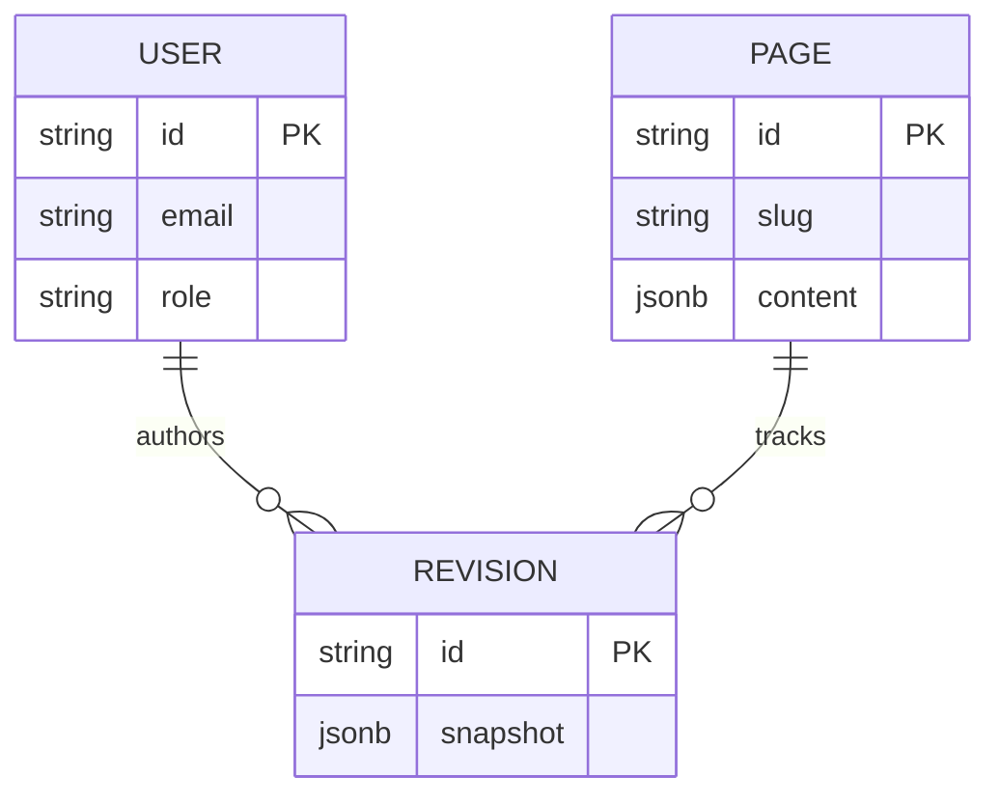

# Database Schema

## Overview
The database is managed via PostgreSQL and Prisma ORM.

### 1. `User` Model
- **Purpose:** Manages authentication and RBAC for the admin portal.
- **Fields:**
  - `id` (String, UUID)
  - `email` (String, Unique)
  - `passwordHash` (String)
  - `role` (Enum: SUPER_ADMIN, ADMIN, EDITOR, CONTRIBUTOR)
  - `createdAt` / `updatedAt`
- **Relationships:** Can author multiple CMS revisions (One-to-Many).

### 2. `Page` Model
- **Purpose:** Represents a unique route or content module in the CMS (e.g., 'home', 'about.institution', 'dept.cse').
- **Fields:**
  - `id` (String, UUID)
  - `slug` (String, Unique)
  - `title` (String)
  - `status` (Enum: DRAFT, PUBLISHED, ARCHIVED)
  - `content` (JSONB) - Holds dynamic block data.
- **Data Flow:** Fetched directly by the frontend based on the current URL slug.

### 3. `Revision` Model
- **Purpose:** Version control and audit trail.
- **Fields:**
  - `id` (String, UUID)
  - `pageId` (Foreign Key -> Page.id)
  - `authorId` (Foreign Key -> User.id)
  - `snapshot` (JSONB) - Exact copy of content at time of save.

## Entity-Relationship Diagram

