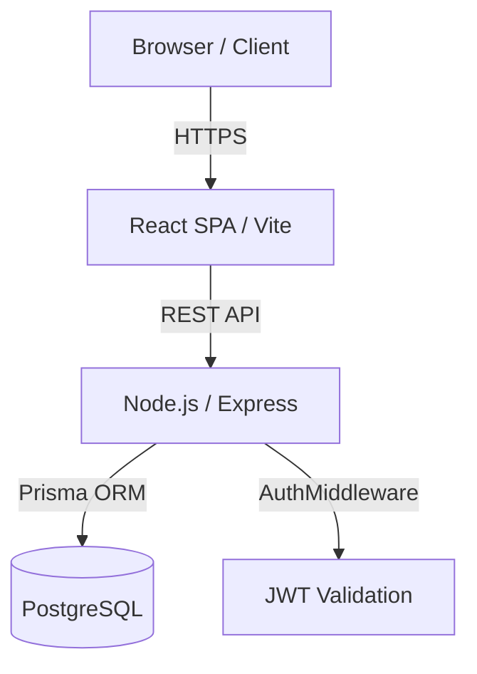
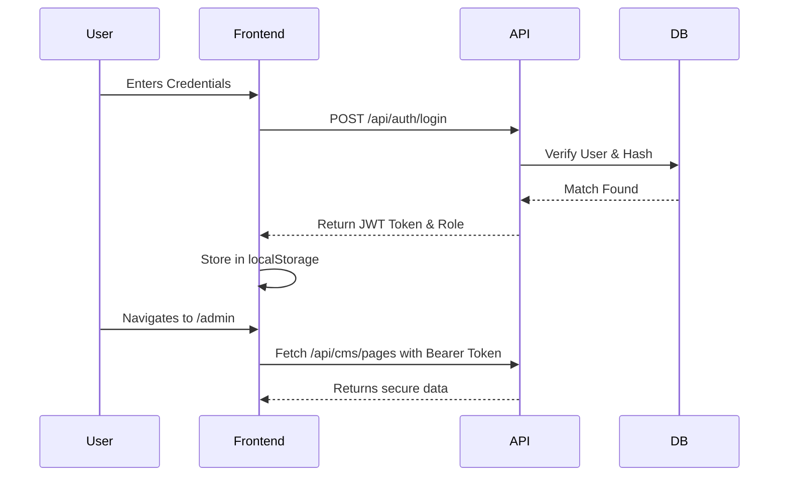

# System Architecture

## Overall Architecture Diagram

## Frontend Architecture
- **Framework:** React 18 with Vite for ultra-fast HMR and optimized production builds.
- **Routing:** `react-router-dom` handles all client-side routing, preventing full-page reloads.
- **Code Splitting:** Heavy routes (like the Admin portal and CMS modules) use `React.lazy` and `Suspense` for chunking.
- **State Management:** React Context API for global states (Auth, Chatbot) and local state for UI modules.

## Backend Architecture
- **Framework:** Express.js over Node.js.
- **Controllers:** Logic separated into distinct modules (`cmsController.js`, `authController.js`).
- **Middleware:** `authMiddleware.js` intercepts requests, validates JWTs, and enforces Role-Based Access Control (RBAC).

## CMS Architecture & Data Flow
The CMS utilizes a hybrid JSON-relational model. 
1. **Draft:** Editors save JSON payloads representing page state. `status` = 'DRAFT'.
2. **Review:** Admins preview the JSON against the actual React components in a secure sandbox.
3. **Publish:** The JSON payload replaces the `PUBLISHED` state and is immediately served to the public UI.

## Authentication Flow

